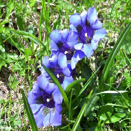
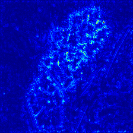
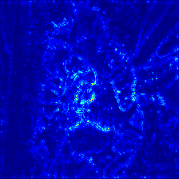
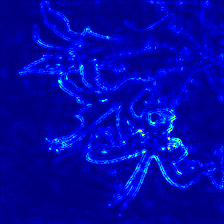
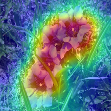
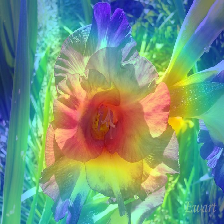
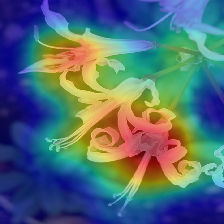

# see-flowers
# Flower Classification with Small Sample Data Using Deep Convolutional Neural Networks

## Overview
This repo provides code and my work on flower image classification using deep convnet. I trained serveral models on [VGG 102 flower dataset](http://www.robots.ox.ac.uk/~vgg/data/flowers/102/) and better the previous state-of-art result, 0.868.  
The best top-1 accuracy achieved so far: 0.892.

## Objectives
* Study the transfer learning on mulitclass, fine grained image classification task.
* Study the visualization tools and techniques for deep convnets.
* Try to explain the convnet-based classifier using visualization.

## Usage
* Preparation
```python
python init.py # download the dataset and organize

```
* Training
```python
python train.py --model=[model_name]

```

## Environment
python 2.7  
keras 2  
(to be completed...)
## Models
  
### Baseline model
A simple 2-layer baseline convnet.  
acc: 0.312  


### VGG16
Fine tune VGG16 with weights pretrained on imagenet.  
acc: 0.757  


### VGG19
Fine tune VGG19 with weights pretrained on imagenet.  
acc: 0.734  


### Inception-v3
Fine tune VGG19 with weights pretrained on imagenet.  
acc: 0.892  


## Visualization
### original image



### saliency



### heatmap]


